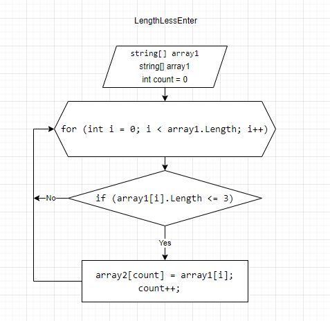

# Задача #

Написать программу, которая из имеющегося массива строк формирует массив из строк, длина которых меньше либо равна 3 символа.
Первоначальный массив можно ввести с клавиатуры, либо задать на старте выполнения алгоритма. 
При решение не рекомендуется пользоваться коллекциями, лучше обойтись исключительно массивами

# Алгоритм #
 

# Алгоритм решения задачи #
1. Создаем 2 массива, в один из которых самостоятельно вводим рандомные значения;
2. Создаем метод, в котором проверяем каждое значение из массива на соответствие условию (длина строки <, либо = 3);
3. Если строка удовлетворяет условию, то данное значение переносится из первого массива во второй, а переменная count увеличивается;
4. Данный цикл проверяеся до того момента, пока i < array1.Length.